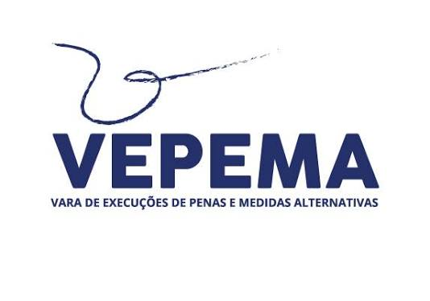
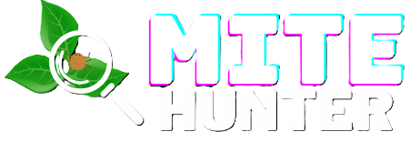

# Bruno Chevitarese

**Estudante de Graduação em Sistemas de Informação @ IFES | Pesquisador de Visão Computacional e IA | Desenvolvedor de Sistemas**

Desenvolvendo soluções de IA aplicada para o setor público e o agronegócio. Meu trabalho está na interseção entre visão computacional, aprendizado profundo e engenharia de software — transformando problemas complexos em sistemas práticos e implantáveis.

  
  &nbsp;
  
  &nbsp;
  
  &nbsp;
  

## Projetos de Pesquisa e Desenvolvimento

### VEPEMA — Automação do Monitoramento de Prestadores de Serviço

  
  Uma solução desenvolvida em parceria com o Tribunal de Justiça do Espírito Santo (VEPEMA/TJES) para automatizar o monitoramento de prestadores de serviço. O sistema registra horários de entrada e saída com alta precisão, automatiza o fluxo de dados e gera relatórios de conformidade — substituindo registros manuais em papel.
    
  

 

### MITEHUNTER — Controle de Pragas com IA para o Cultivo de Morango

  
  Um sistema de recomendação baseado em aprendizado profundo que usa redes neurais YOLO para identificar infestações do ácaro-rajado (*Tetranychus urticae*) em plantas de morango. O sistema sugere ações de controle (químico, fitoterápico ou biológico) para ajudar agricultores a evitar perdas de produtividade de até 20%.
    
  

 

## Áreas em que atuo

- **Visão Computacional e Aprendizado Profundo** — detecção de objetos, classificação de imagens e sistemas de recomendação usando YOLO e redes neurais.
- **Desenvolvimento de Sistemas** — engenharia de software de ciclo completo, do levantamento de requisitos à implantação, com foco em automação e tomada de decisão orientada por dados.
- **IA Aplicada para Impacto Social** — soluções para monitoramento de serviços públicos e controle de pragas agrícolas.
- **Computação Científica** — integração de inteligência computacional com problemas do mundo real nos setores público e do agronegócio.

## Trajetória

Sou estudante de graduação em Sistemas de Informação no Instituto Federal do Espírito Santo (IFES), com forte foco em pesquisa aplicada em visão computacional, inteligência artificial e desenvolvimento de sistemas. Participei de projetos de inovação tecnológica em parceria com o Tribunal de Justiça do Espírito Santo (VEPEMA) e com o setor de produção de morango em Santa Maria de Jetibá — uma das principais regiões produtoras de morango do Brasil. Minha experiência inclui modelagem de dados, arquitetura de APIs, engenharia de software e computação científica. Já apresentei meu trabalho em exposições nacionais, incluindo a Semana Nacional da Educação Profissional e Tecnológica e a Semana Nacional de Ciência e Tecnologia, e supervisionei projetos de iniciação científica financiados pela FAPES.

## Entre em contato

Estou aberto a oportunidades de colaboração, parcerias de pesquisa e projetos de desenvolvimento de software. Fique à vontade para entrar em contato por [e-mail](mailto:chevitarese.bruno@gmail.com) ou se conectar comigo no [LinkedIn](https://www.linkedin.com/in/bruno-chevitarese/). Você também pode conferir meu perfil acadêmico completo no [Lattes](http://lattes.cnpq.br/1261867108959311).

<!-- PROFILE_LAST_REVIEWED: 2026-10-02 -->